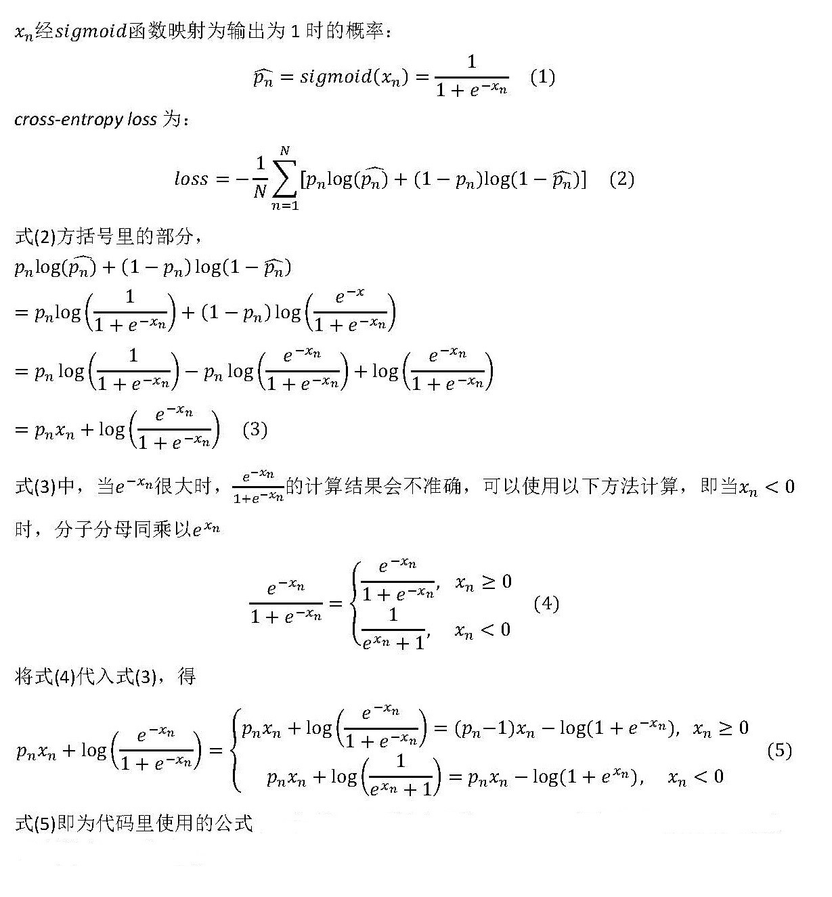
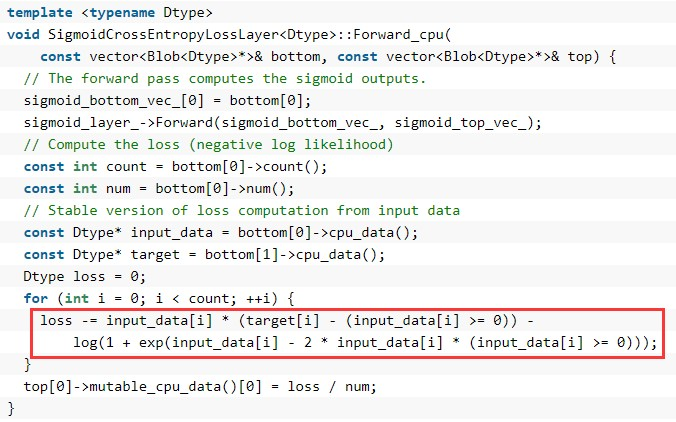

##A-Fast-RCNN: Hard Positive Generation via Adversary for Object Detection
[paper](https://arxiv.org/abs/1704.03414)

##一、论文思想
    训练一个目标检测器，对遮挡和形变鲁棒，目前的主要方法是增加不同场景下的图像数据，但这些数据有时又特别少。作者提出使用对抗生成有遮挡或形变的样本，这些样本对检测器来说识别比较困难，使用这些困难的正样本训练可以增加检测器的鲁棒性。 使用对抗网络生成有遮挡和有形变的两种特征，分别对应网络ASDN和ASTN。使用对抗网络生成有遮挡和有形变的两种特征，分别对应网络ASDN和ASTN。

* 方便的`导入导出`功能
    *  直接把一个markdown的文本文件拖放到当前这个页面就可以了
    *  导出为一个html格式的文件，样式一点也不会丢失
* 编辑和预览`同步滚动`，所见即所得（右上角设置）
* `VIM快捷键`支持，方便vim党们快速的操作 （右上角设置）
* 强大的`自定义CSS`功能，方便定制自己的展示
* 有数量也有质量的`主题`,编辑器和预览区域
* 完美兼容`Github`的markdown语法
* 预览区域`代码高亮`
* 所有选项自动记忆

###1.ASDN
* FAST-RCNN中RoI-池化层之后的每个目标proposal卷积特征作为对抗网络的输入，给定一个目标的特征，ASDN尝试生成特征某些部分被dropout的掩码，导致检测器无法识别该物体。
* `ASDN网络初始化`:
给定尺寸大小为d×d的特征图X，使用d3×d3的滑动窗，并将滑动窗位置映射到原图，将原图对应位置清零，生成新的特征向量，传入到分类层计算损失，选择具有最大损失的滑动窗，用这个窗口生成二值掩码M(滑动窗位置为1，其余位置为0)，用n个目标proposal生成n对对抗网络的训练样本（x1,M1）,...,(xn,Mn) ，使用二值交叉熵损失训练ASDN: 

* 在前向传播过程中，首先使用ASDN在RoI-池化层之后生成特征掩码，然后使用重要性采样法生成二值掩码，使用该掩码将特征对应部位值清零，修改后的特征继续前向传播计算损失。这个过程生成了困难的特征，用于训练检测器。训练过程流程图如下所示：

###2.ASTN
* STN网络包含三部分：定位网络，网格生成器，采样器。定位网络估计出形变的参数（旋转角度、平移距离和缩放因子）。这三个参数作为后两部分的输入，输出是形变后的特征图。论文主要学习定位网络的三个参数。
* `ASTN`:
主要关注特征旋转，定位网络包含三层全连接层，前两层是ImageNet预训练的fc6和fc7，训练过程与ASDN类似，ASTN对特征进行形变，使得ASTN将正样本识别成负样本。将特征图划分为4个block，每个block估计四个方向的旋转，增加了任务的复杂度。
* 两种对抗网络可以相结合，使得检测器更鲁棒，RoI-池化层提取的特征首先传入ASDN丢弃一些激活，之后使用ASTN对特征进行形变，如下图所示：

* ASDN 与 ASTN 网络组合架构示意。首先创建遮挡蒙版，随后旋转路径以产生用于训练的例子。

##二、训练
###stage1：training a standard Fast-RCNN
    ./experiments/scripts/fast_rcnn_std.sh  [GPU_ID]  VGG16 pascal_voc
###stage2:pre-training stage for the adversarial network
    ./experiments/scripts/fast_rcnn_adv_pretrain.sh  [GPU_ID]  VGG16 pascal_voc
###stage3:copy the weights of the above two models to initialize the joint model
    ./copy_model.h
###stage4: joint training of the detector and the adversarial network
    ./experiments/scripts/fast_rcnn_adv.sh  [GPU_ID]  VGG16 pascal_voc

##三、代码解析
###1.sigmod交叉熵
* 交叉熵化简：  
  

   

* 进一步可化简为：  
  

* 代码中使用最终的化简公式：  
  

* 对应本文中的代码是：  ***adversarial-frcnn/lib/roi_data_layer/layer.py***  

* 代码解析：  
#####1.注意绝对值使用的巧妙之处：
** lZ  = np.log(1+np.exp(-np.abs(f))) * mask
Lz对应化简公式的第二项，其中e的指数项x在两种情况下，均为非正，可以概括为代码中np.exp(-np.abs(f))
#####2.注意判断语句使用的巧妙之处：
** ((f>0)-t)*f * mask该项对应化简公式的第一项，对应caffe源码为:  

##四、参考链接
* caffe网络可视化工具：http://ethereon.github.io/netscope/#/editor
* 交叉熵公式推导：http://caffecn.cn/?/question/25
* 交叉熵公式说明：http://blog.csdn.net/u014114990/article/details/47975739
* 论文代码：https://github.com/xiaolonw/adversarial-frcnn  

##关于作者
edited by [fangfang](https://github.com/orgs/hustcv/people/galaxy-fangfang) [xiuhong](https://github.com/orgs/hustcv/people/summerZXH)